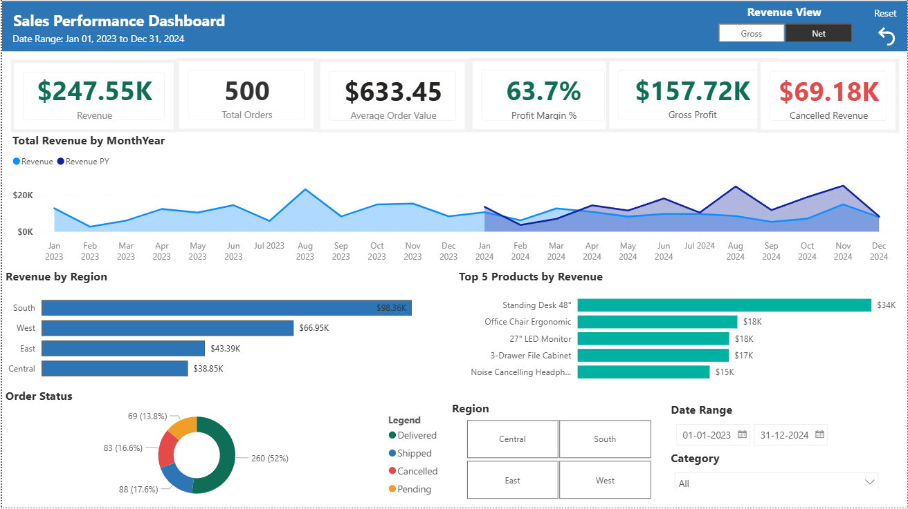
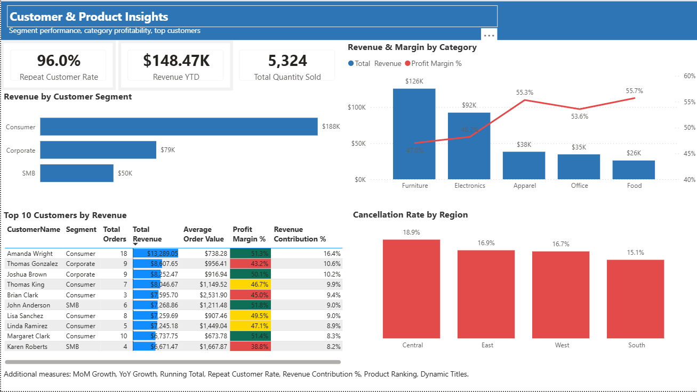
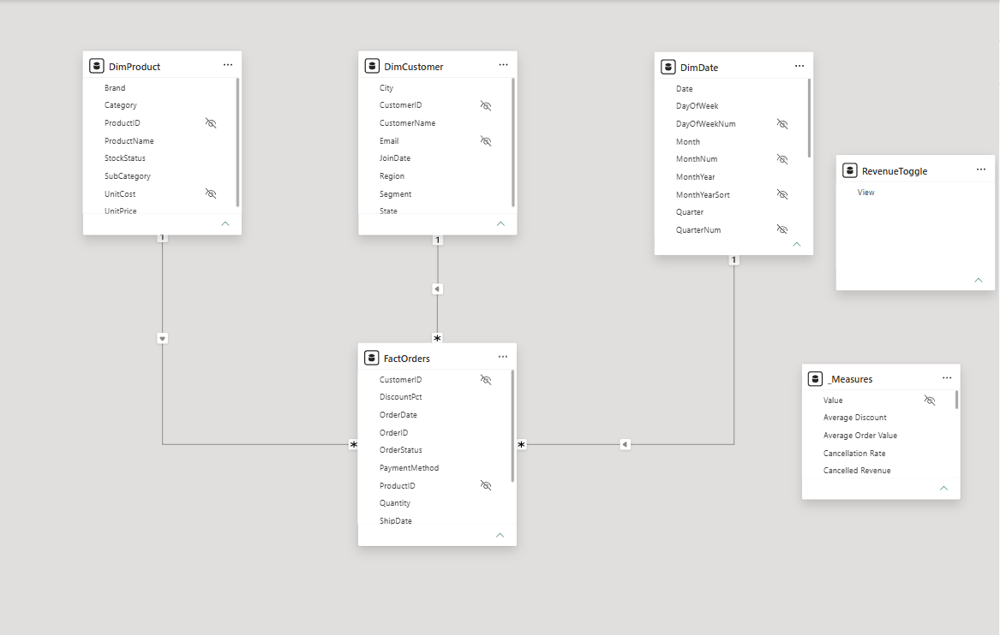

# Sales Performance Dashboard (Power BI)

An interactive Power BI dashboard analyzing sales performance, customer behavior, and product-level insights across Jan 2023 to Dec 2024. Built using Claude (Anthropic) via MCP server integration, with a star schema data model and custom DAX measures for time intelligence, dynamic revenue toggling, and segment-level profitability analysis.

---

## Dashboard Pages

### 1. Sales Performance


Tracks revenue trends and order-level KPIs over time, with Gross vs. Net revenue toggle and filters for region, category, and date range.

| KPI | Value |
|---|---|
| Total Revenue | $247.55K |
| Total Orders | 500 |
| Average Order Value | $633.45 |
| Profit Margin % | 63.7% |
| Gross Profit | $157.72K |
| Cancelled Revenue | $69.18K |

Visuals include: Revenue vs. Prior Year line chart, Revenue by Region bar chart, Top 5 Products by Revenue, and Order Status donut (52% Delivered, 17.6% Shipped, 16.6% Cancelled, 13.8% Pending).

---

### 2. Customer & Product Insights


Breaks down performance by customer segment, product category, and regional cancellation rates.

| KPI | Value |
|---|---|
| Repeat Customer Rate | 96.0% |
| Revenue YTD | $148.47K |
| Total Quantity Sold | 5,324 |

Visuals include: Revenue by Customer Segment (Consumer $188K, Corporate $79K, SMB $50K), Revenue & Margin by Category combo chart, Top 10 Customers table with profit margin heat map, and Cancellation Rate by Region bar chart.

---

## Data Model



Star schema with `FactOrders` at the center, connected to four dimension tables via one-to-many relationships.

| Table | Key Columns |
|---|---|
| `FactOrders` | OrderID, CustomerID, ProductID, OrderDate, Quantity, DiscountPct, OrderStatus, PaymentMethod, ShipDate |
| `DimProduct` | ProductID, ProductName, Category, SubCategory, Brand, UnitCost, UnitPrice, StockStatus |
| `DimCustomer` | CustomerID, CustomerName, Segment, Region, State, City, Email, JoinDate |
| `DimDate` | Date, Month, MonthYear, Quarter, DayOfWeek and sort/num variants for correct ordering |
| `RevenueToggle` | View (drives Gross vs. Net dynamic measure) |
| `_Measures` | All DAX measures isolated in a dedicated table |

---

## DAX Measures

| Measure | Description |
|---|---|
| Total Revenue / Selected Revenue | Core revenue with dynamic Gross vs. Net toggle |
| Revenue PY | Prior year revenue via time intelligence |
| Revenue YoY Growth | Year-over-year % change |
| Revenue MoM Growth | Month-over-month % change |
| Revenue YTD | Year-to-date running total |
| Gross Profit / Profit Margin % | Profitability measures |
| Average Order Value | Revenue / Total Orders |
| Average Discount | Discount analysis |
| Repeat Customer Rate | % of returning customers |
| Cancellation Rate / Cancelled Revenue | Order health metrics |
| Revenue Contribution % | Share of total per product/customer |

---

## How to Open

1. Download [Power BI Desktop](https://powerbi.microsoft.com/desktop/) (free)
2. Clone or download this repo
3. Open `Sales.pbix` in Power BI Desktop

> Note: The report uses imported data. No live data source connection is required to explore the visuals.

---

## Repo Structure

```
sales-powerbi-dashboard/
  Sales.pbix
  README.md
  .gitignore
  screenshots/
    sales_performance.png
    customer_product_insights.png
    data_model.png
```

---

## Tech Stack

- Power BI Desktop
- DAX (Data Analysis Expressions)
- Star schema data model
- Time intelligence (YTD, YoY, MoM)
- Built with assistance from Claude (Anthropic) via MCP server integration

---

## Author

**Harsha**

